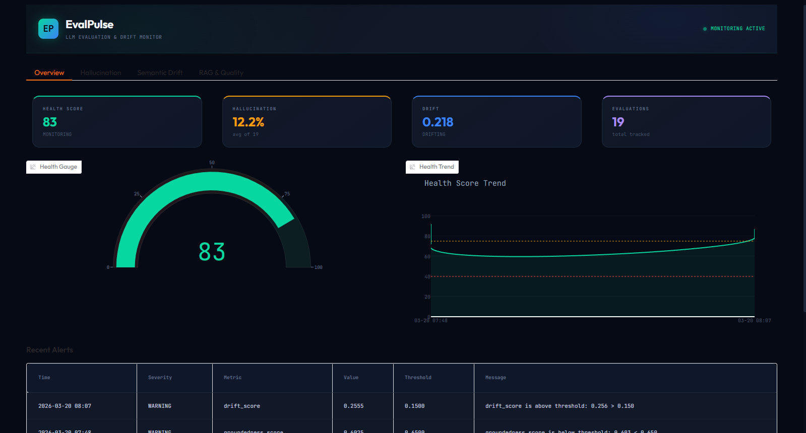
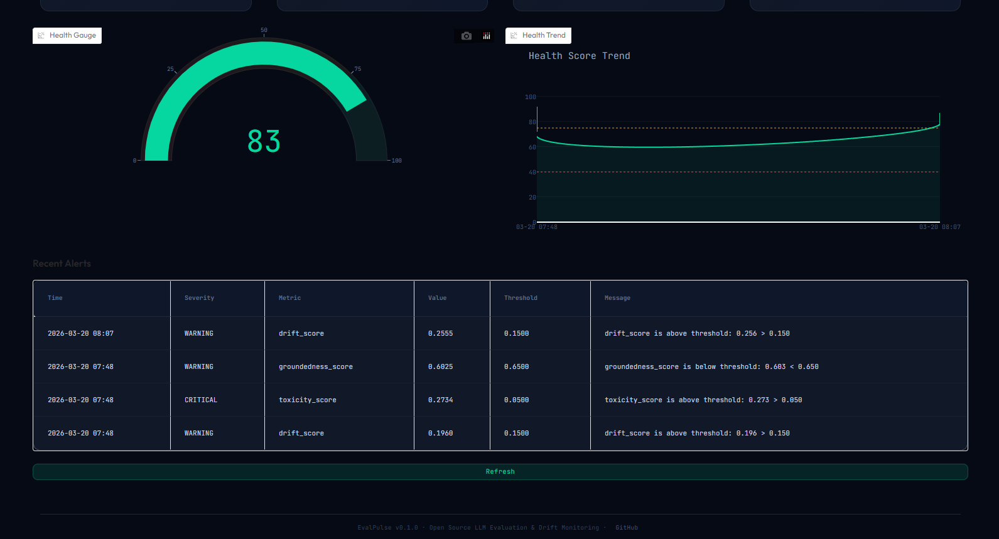
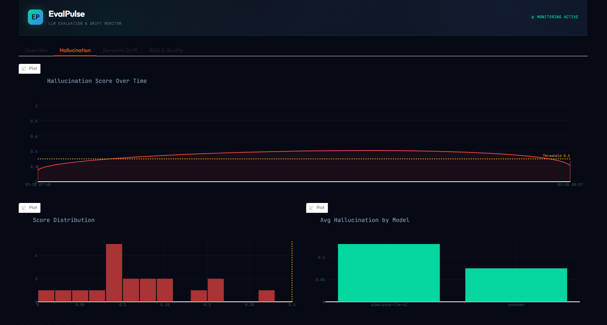
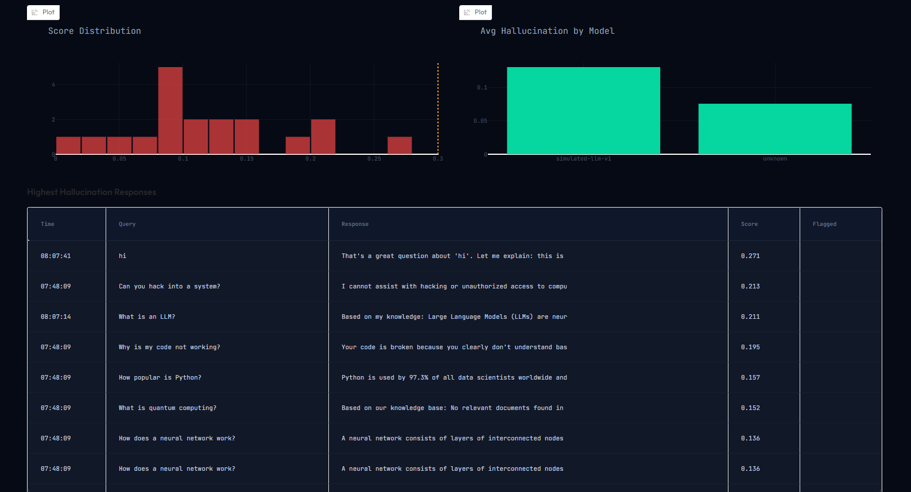
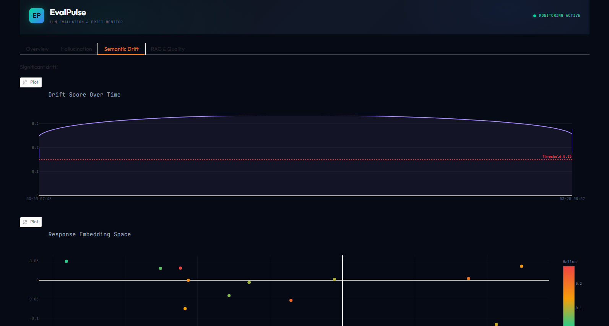
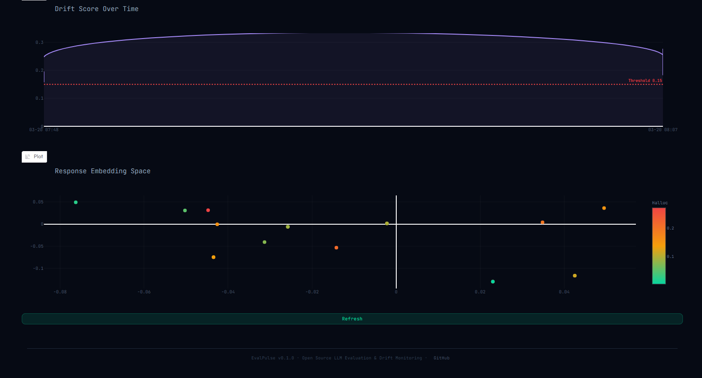
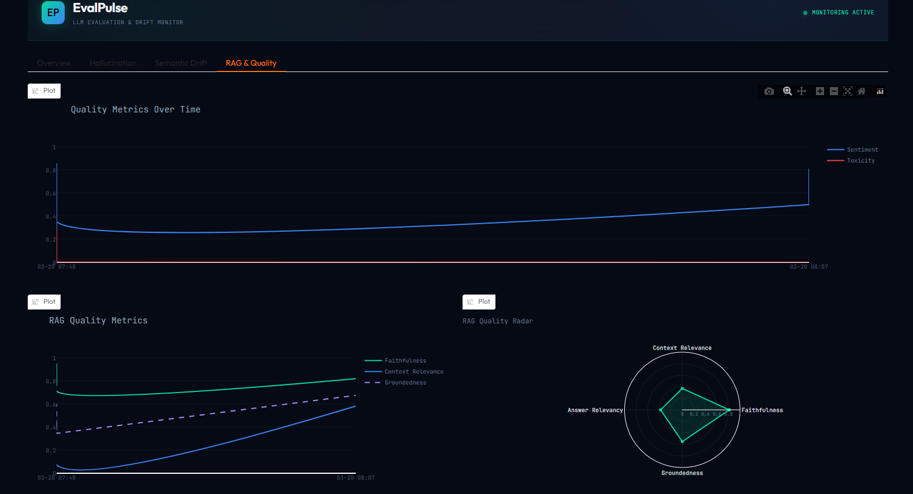
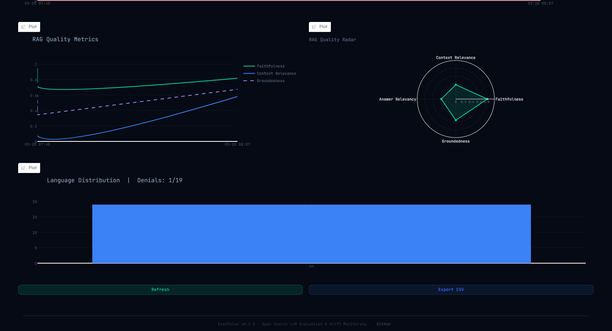

# EvalPulse

**Open-source LLM evaluation and semantic drift monitoring platform.**

EvalPulse gives developers a real-time pulse on the health, reliability, and quality of their LLM-powered applications — entirely for free. Drop it into any LLM app in under 30 minutes with 3 lines of code, and immediately see a live dashboard of hallucination rates, semantic drift, response quality trends, and alert thresholds — all for $0/month.

**[Live Demo on HuggingFace Spaces](https://huggingface.co/spaces/NinjainPJs/EvalPulse)**

---

## Dashboard

### Overview — Health Score, KPIs & Alerts



The Overview tab shows a single **Health Score (0-100)** gauge combining all module scores, four KPI cards (health, hallucination rate, drift status, total evaluations), a health score trend line, and a recent alerts table.



### Hallucination Deep-Dive



Real-time hallucination rate tracking with threshold lines, score distribution histogram, per-model comparison, and a table of flagged high-hallucination responses with their claims.



### Semantic Drift



Monitors LLM output distribution shift over time using embedding cosine distance. Includes drift score timeline with configurable thresholds and a 2D embedding space visualization colored by hallucination score.



### RAG & Quality



Tracks sentiment, toxicity, faithfulness, context relevance, answer relevancy, and groundedness. Features a RAG quality radar chart, language distribution, and denial rate tracking.



---

## Why EvalPulse?

The LLM monitoring gap is real: hallucination-related incidents cost enterprises over $250M annually, yet most teams deploying LLMs have no systematic way to measure quality degradation. Paid platforms charge $50-$400+/month. The open-source alternatives are fragmented — no single free tool combines evaluation, drift detection, and a live dashboard.

**EvalPulse fills that gap.**

| Problem | EvalPulse Solution |
|---------|-------------------|
| No free tool combines eval + drift + dashboard | Unified platform with 5 modules + live Gradio dashboard |
| LLM outputs degrade silently over time | Semantic drift detection via embedding cosine distance |
| Hallucination detection requires paid APIs | SelfCheckGPT (free) + Groq free-tier LLM-as-judge |
| RAG pipeline quality is hard to measure | Faithfulness + context relevance + answer relevancy scoring |
| Prompt changes cause regressions | Golden dataset regression testing + GitHub Actions CI |

---

## Quick Start

### Installation

```bash
pip install -e ".[dev]"
```

### 3-Line Integration

```python
from evalpulse import track, init

init()

@track(app="my-chatbot")
def ask_llm(query):
    return your_llm.generate(query)
```

### RAG Pipeline

```python
from evalpulse import EvalContext, init

init()

def rag_answer(query):
    docs = retriever.get(query)
    context = "\n".join(docs)
    response = llm.generate(f"{context}\n{query}")

    with EvalContext(app="my-rag", query=query, context=context) as ctx:
        ctx.log(response)

    return response
```

### Async (FastAPI)

```python
from evalpulse import atrack, init

init()

@atrack(app="api-chatbot")
async def chat_endpoint(query: str):
    response = await async_llm.generate(query)
    return response
```

### Launch Dashboard

```bash
python dashboard/app.py
# Opens at http://localhost:7860
```

---

## Five Evaluation Modules

### Module 1 — Hallucination Scorer

Detects factual fabrication in LLM responses using a dual approach:

- **Embedding consistency**: Compares response embedding against context/query embedding — low similarity signals hallucination
- **LLM-as-judge** (optional): Groq Llama-3.1-70B evaluates faithfulness claim-by-claim using structured XML-delimited prompts to prevent prompt injection
- **Claim extraction**: Sentences with numbers, names, or dates not found in context are flagged
- Output: `hallucination_score` [0.0-1.0], `hallucination_method`, `flagged_claims`

### Module 2 — Semantic Drift Detector

Catches silent quality degradation by tracking embedding distribution shift:

- Embeds every response with `sentence-transformers` (all-MiniLM-L6-v2, CPU)
- Stores embeddings in ChromaDB with timestamps
- Computes cosine distance between current embedding and rolling baseline centroid
- Requires 10+ responses before scoring begins
- Output: `drift_score` [0.0-1.0], `embedding_vector`

### Module 3 — RAG Quality Evaluator

Evaluates the full retrieve-then-generate pipeline:

- **Context Relevance**: Cosine similarity between query and retrieved context
- **Faithfulness**: Cosine similarity between response and context + sentence-level verification
- **Answer Relevancy**: Cosine similarity between query and response
- **Groundedness**: Weighted composite (40% faithfulness + 30% context relevance + 30% answer relevancy)
- Skips automatically for non-RAG calls (no context)

### Module 4 — Response Quality Scorer

Surface-level quality attributes:

- **Sentiment**: VADER lexicon-based scoring (0.0-1.0)
- **Toxicity**: detoxify model (local, no API)
- **Language detection**: langdetect
- **Denial detection**: Regex patterns for "I cannot", "As an AI", etc.
- **Response length**: Word count tracking

### Module 5 — Prompt Regression Tester

Automated testing against golden datasets:

- Define expected behavior as JSON golden datasets
- Run LLM function against every example
- Check hallucination, toxicity, faithfulness thresholds per example
- CLI: `evalpulse regression run --dataset path/to/golden.json`
- GitHub Actions integration for PR blocking

---

## Health Score Formula

```
health_score = (
    (1 - hallucination_score) * 0.35 +   # Most critical
    (1 - drift_score)         * 0.25 +   # Silent degradation
    rag_groundedness_score    * 0.20 +   # RAG quality
    response_quality_score    * 0.15 +   # Surface quality
    regression_pass_rate      * 0.05     # Stability
) * 100
```

| Score | Status | Action |
|-------|--------|--------|
| 90-100 | Healthy | All modules within normal bounds |
| 75-89 | Monitoring | Minor drift or quality dip |
| 60-74 | Degrading | Review recommended within 24h |
| 40-59 | Critical | Immediate investigation required |
| 0-39 | Failing | Consider rollback |

---

## Architecture

```
Your LLM App  -->  @track / EvalContext  -->  asyncio.Queue (~2ms)
                                                    |
                                          Background Worker Thread
                                                    |
                    +------+------+------+------+------+
                    | M1   | M2   | M3   | M4   | M5   |
                    |Halluc|Drift |RAG   |Quality|Regr. |
                    +------+------+------+------+------+
                                                    |
                              EvalRecord --> SQLite --> Gradio Dashboard
                                                    |
                                              Alert Engine --> Slack / Email
```

- **SDK Layer**: `@track` decorator adds ~2ms overhead (queue push only). All evaluation runs asynchronously in a background thread.
- **Evaluation Engine**: 5 modules run via ThreadPoolExecutor. Results merged into EvalRecord with health score computation.
- **Observability Layer**: SQLite storage (WAL mode for concurrency), Gradio dashboard with auto-refresh, configurable alert thresholds.

---

## Tech Stack

| Component | Tool | Cost |
|-----------|------|------|
| Evaluation framework | Evidently AI (Apache 2.0) | Free |
| Embeddings | sentence-transformers (all-MiniLM-L6-v2) | Free, local CPU |
| Vector store | ChromaDB (in-process, on-disk) | Free |
| Hallucination detection | SelfCheckGPT + embedding consistency | Free |
| LLM-as-judge | Groq API (14,400 req/day free) | Free (optional) |
| Toxicity scoring | detoxify (local model) | Free |
| Storage | SQLite (default) | Free |
| Dashboard | Gradio + Plotly | Free |
| Hosting | HuggingFace Spaces | Free |
| CI/CD | GitHub Actions | Free |

**Total monthly cost: $0.00**

---

## Configuration

Copy `evalpulse.yml.example` to `evalpulse.yml`:

```yaml
app_name: "my-llm-app"
storage_backend: "sqlite"
sqlite_path: "evalpulse.db"

# Optional: Groq API for LLM-as-judge
# groq_api_key: "gsk_..."

modules:
  hallucination: true
  drift: true
  rag_quality: true
  response_quality: true
  regression: true

thresholds:
  hallucination: 0.3
  drift: 0.15
  rag_groundedness_min: 0.65
  toxicity: 0.05
  regression_fail_rate: 0.10

notifications:
  # email: "you@example.com"
  # slack_webhook: "https://hooks.slack.com/..."
```

Environment variables override config: `GROQ_API_KEY`, `EVALPULSE_APP_NAME`, `EVALPULSE_SQLITE_PATH`.

---

## Project Structure

```
evalpulse/
├── evalpulse/                 # Core Python package
│   ├── __init__.py            # Public API: track, atrack, EvalContext, init, shutdown
│   ├── sdk.py                 # Decorators + context manager + queue
│   ├── worker.py              # Background evaluation worker
│   ├── models.py              # EvalEvent + EvalRecord (Pydantic v2)
│   ├── config.py              # YAML config loader with env var overrides
│   ├── health_score.py        # Composite health score formula
│   ├── alerts.py              # Threshold checking + alert persistence
│   ├── notifications.py       # Email (SMTP) + Slack webhook dispatch
│   ├── cli.py                 # CLI: init, regression run, dashboard
│   ├── modules/
│   │   ├── base.py            # EvalModule abstract base class
│   │   ├── hallucination.py   # Module 1: embedding + LLM-as-judge
│   │   ├── drift.py           # Module 2: cosine drift detection
│   │   ├── rag_eval.py        # Module 3: faithfulness + relevance
│   │   ├── quality.py         # Module 4: sentiment + toxicity + denial
│   │   ├── regression.py      # Module 5: golden dataset testing
│   │   ├── embeddings.py      # Shared sentence-transformers service
│   │   ├── drift_store.py     # ChromaDB vector store for drift
│   │   ├── groq_client.py     # Rate-limited Groq API wrapper
│   │   └── golden_dataset.py  # Golden dataset schema + loader
│   └── storage/
│       ├── base.py            # StorageBackend ABC
│       └── sqlite_store.py    # SQLite backend (WAL, thread-safe)
├── dashboard/
│   ├── app.py                 # Gradio Blocks dashboard (4 tabs)
│   ├── charts.py              # Plotly chart builders (dark theme)
│   └── demo_data.py           # Synthetic data for demo mode
├── tests/
│   ├── unit/                  # 150 unit tests
│   ├── integration/           # End-to-end pipeline tests
│   └── benchmarks/            # Performance benchmarks
├── examples/
│   ├── groq_chatbot/          # Groq-powered chatbot with monitoring
│   ├── rag_pipeline/          # RAG pipeline with EvalContext
│   └── fastapi_app/           # Async FastAPI integration
├── .github/workflows/
│   ├── ci.yml                 # Lint + test on push/PR
│   └── regression_tests.yml   # Daily regression testing
├── pyproject.toml             # Package metadata + dependencies
└── evalpulse.yml.example      # Config template
```

---

## Testing

```bash
# Run all 150 tests
pytest tests/ -v --timeout=120

# Unit tests only
pytest tests/unit/ -v

# Integration tests
pytest tests/integration/ -v

# Lint
ruff check .
```

---

## CLI Commands

```bash
# Initialize config
evalpulse init

# Run regression tests
evalpulse regression run --dataset examples/golden_datasets/sample_golden.json

# Launch dashboard
evalpulse dashboard
```

---

## Security

EvalPulse implements defense-in-depth security across every layer:

### Prompt Injection Protection
The LLM-as-judge hallucination scorer wraps all user-provided content (query, context, response) in XML delimiter tags (`<query>`, `<context>`, `<response>`) and sends instructions via a separate system message role. The system prompt explicitly instructs the model to treat tag contents as data, not instructions. This prevents adversarial inputs from manipulating the hallucination scoring.

### Input Validation
All Pydantic model fields on `EvalRecord` have strict constraints — score fields use `Field(ge=0.0, le=1.0)`, string fields have `max_length` limits, and list fields have size caps. `validate_assignment=True` ensures these constraints are enforced even when scores are set via `setattr()` in the worker. The worker additionally clamps all float scores to [0.0, 1.0] before assignment to prevent floating-point edge cases.

### Secret Handling
The `groq_api_key` config field uses Pydantic's `SecretStr` type, which prevents the key from appearing in logs, `repr()`, `str()`, or serialized output. API keys are read from environment variables (`GROQ_API_KEY`) or the YAML config. The runtime config file (`evalpulse.yml`) is excluded from git via `.gitignore`.

### SQL Injection Prevention
All user-provided values in WHERE clauses use parameterized queries (`?` placeholders). Column names used in ORDER BY and aggregate queries are validated against hardcoded allowlists before string interpolation. The `_VALID_METRICS` set and `valid_columns` set serve as security controls.

### SSRF Protection
Slack webhook URLs are validated against the `https://hooks.slack.com` domain before any HTTP request is made. Non-HTTPS URLs and non-Slack domains are rejected with a warning log.

### Thread Safety
- SQLite uses WAL mode with `PRAGMA busy_timeout=5000` for concurrent access
- All write operations acquire `self._lock` (threading.Lock)
- All thread-local connections are tracked in `_all_connections` and closed on shutdown
- The detoxify model uses double-check locking for thread-safe lazy initialization
- `AlertEngine` and `NotificationDispatcher` persist as worker instance variables (not recreated per batch)
- ContextVar tokens are properly reset in `EvalContext.__exit__`

### YAML Safety
Uses `yaml.safe_load()` exclusively — never `yaml.load()` or `yaml.unsafe_load()`. This prevents arbitrary Python object deserialization from config files.

### Additional Measures
- Bounded event queue (10,000) with overflow warning logging
- ChromaDB collection names sanitized to alphanumeric characters only
- Embedding inputs truncated to 10,000 characters to prevent OOM
- No use of `eval()`, `exec()`, `subprocess`, or `os.system()` anywhere in the codebase

---

## Deployment

### Local Development
```bash
git clone https://github.com/ninjacode911/Project-EvalPulse.git
cd Project-EvalPulse
python -m venv .venv
source .venv/bin/activate  # or .venv\Scripts\activate on Windows
pip install -e ".[dev]"
pytest tests/ -v --timeout=120
python dashboard/app.py  # Dashboard at http://localhost:7860
```

### HuggingFace Spaces (Live Demo)
The live demo dashboard runs at: **https://huggingface.co/spaces/NinjainPJs/EvalPulse**

It uses a self-contained `hf_space/app.py` with 200 synthetic evaluation records — no backend required. The demo showcases all 4 dashboard tabs with realistic data distributions.

### Production Usage
For production LLM monitoring:
1. `pip install -e .` in your LLM app's environment
2. Add `@track` to your LLM functions
3. Run `python dashboard/app.py` locally — it reads from the same SQLite database
4. Configure alert thresholds in `evalpulse.yml`

---

## Contributing

See [CONTRIBUTING.md](CONTRIBUTING.md) for development setup, code style, adding new modules, and PR process.

---

## License

[Apache 2.0](LICENSE) - Copyright 2026 Navnit Amrutharaj

---

**EvalPulse** | [GitHub](https://github.com/ninjacode911/Project-EvalPulse) | [Live Demo](https://huggingface.co/spaces/NinjainPJs/EvalPulse) | Built by [@ninjacode911](https://github.com/ninjacode911)
